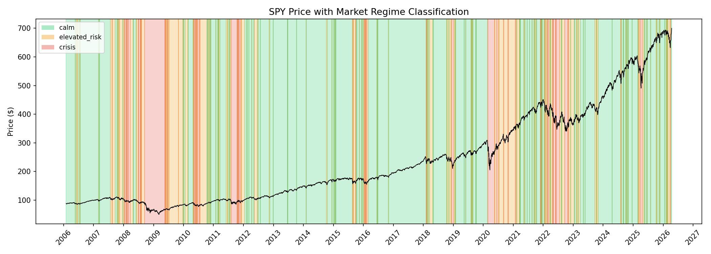
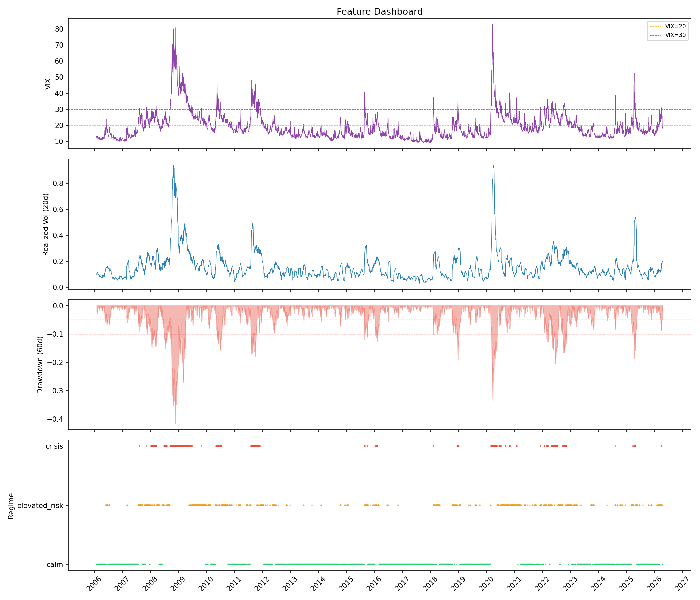

# Market Regime and Volatility Intelligence System

A Python-based system that detects and classifies US equity market volatility regimes using SPY and VIX data. Computes risk features from historical price data, applies rule-based regime classification, validates against known market events, and exposes results through a FastAPI service.

This is a **descriptive analysis tool**, not a trading bot or price prediction system.

## Visualizations

### Regime Timeline
SPY price with regime-colored background shading (green = calm, orange = elevated risk, red = crisis):



### Feature Dashboard
Multi-panel view of VIX, realized volatility, drawdown depth, and regime labels:



## What It Does

- Downloads 20 years of daily SPY and VIX data via yfinance
- Computes risk features: rolling realized volatility, drawdown depth, VIX-realized vol spread, return z-scores
- Classifies each trading day into one of three regimes: **calm**, **elevated_risk**, or **crisis**
- Validates the classifier against 11 known market events (2008 crisis, COVID, 2025 tariffs, etc.)
- Computes regime statistics: durations, transition probabilities, return distributions by regime
- Generates regime timeline and feature dashboard visualizations
- Serves regime data and features through a REST API

## Regime Classification

Regimes are assigned using a rule-based classifier with the following logic (priority order):

| Regime | Condition |
|--------|-----------|
| **crisis** | VIX >= 30 OR 60-day drawdown <= -10% |
| **elevated_risk** | VIX >= 20 OR 60-day drawdown <= -5% |
| **calm** | Everything else |

Over the full dataset (2006-2026), the distribution is approximately:
- **calm**: 62.5% of trading days
- **elevated_risk**: 25.5%
- **crisis**: 12.0%

## Event Validation

The classifier was validated against 11 known market events, including 2 calm-period controls:

| Event | Period | Expected | Result |
|-------|--------|----------|--------|
| 2008 Financial Crisis | Sep-Nov 2008 | crisis | PASS |
| 2010 Flash Crash | May 2010 | elevated_risk | PASS |
| 2011 US Debt Downgrade | Aug-Oct 2011 | crisis | PASS |
| 2015 China Devaluation | Aug-Sep 2015 | crisis | PASS |
| 2018 Q4 Selloff | Dec 2018 | elevated_risk | PASS |
| COVID-19 Crash | Mar-Apr 2020 | crisis | PASS |
| 2022 Bear Market | Jun 2022 | elevated_risk | PASS |
| 2023 SVB / Banking Crisis | Mar 2023 | elevated_risk | PASS |
| 2025 Tariff Shock | Apr 2025 | crisis | PASS |
| 2013 Bull Market (control) | Jun-Aug 2013 | calm | PASS |
| 2017 Low Vol (control) | Jun-Aug 2017 | calm | PASS |

**11/11 events correctly identified.**

## Key Regime Statistics

**Transition Probabilities** (probability of next day's regime given today's):

| From \ To | calm | elevated_risk | crisis |
|-----------|------|---------------|--------|
| calm | 95.3% | 4.7% | 0.0% |
| elevated_risk | 11.5% | 83.5% | 5.0% |
| crisis | 0.0% | 10.8% | 89.2% |

Key finding: The market almost never jumps directly from calm to crisis — it transitions through elevated_risk first. Crisis is sticky once entered (89% self-transition).

**Average Return by Regime** (annualized):
- calm: +34.1%
- elevated_risk: -7.0%
- crisis: -76.8%

## Features Computed

| Feature | Description |
|---------|-------------|
| `log_return` | Daily log return of SPY |
| `realized_vol_20d` | 20-day rolling annualized volatility |
| `drawdown_60d` | 60-day rolling maximum drawdown |
| `return_zscore_20d` | Z-score of daily return over 20-day window |
| `vix_rv_spread` | VIX minus annualized realized vol (implied vs. realized gap) |

## API Endpoints

| Endpoint | Description |
|----------|-------------|
| `GET /health` | Health check |
| `GET /regime/current` | Current regime with supporting features |
| `GET /regime/history?start=YYYY-MM-DD&end=YYYY-MM-DD` | Regime labels over a date range |
| `GET /features/latest` | Most recent row of the feature table |
| `GET /summary` | Dataset overview and regime distribution |

## Quick Start

```bash
# Clone and set up
git clone https://github.com/arthurykim/market-regime-intelligence.git
cd market-regime-intelligence
python3 -m venv .venv
source .venv/bin/activate
pip install -r requirements.txt

# Run tests
python -m pytest tests/ -v

# Run full pipeline (downloads data, computes features, generates reports + charts)
python scripts/run_pipeline.py

# Start the API
uvicorn app.main:app --reload

# Test it
curl http://localhost:8000/summary
```

## Project Structure

```
market-regime-intelligence/
  app/
    main.py                          # FastAPI entry point
    config.py                        # Parameters, thresholds, paths
    api/routes.py                    # Endpoint definitions
    services/
      data_loader.py                 # yfinance ingestion + parquet caching
      feature_engineering.py         # Risk feature computation
      regime_classifier.py           # Rule-based regime classification
      summary_service.py             # Orchestration layer for API
    models/schemas.py                # Pydantic response models
    utils/
      plotting.py                    # Visualization generation
      logging_utils.py               # Logger config
  evaluation/
    event_validation.py              # Validate classifier against known events
    regime_statistics.py             # Duration, transition, and return analysis
  scripts/
    run_pipeline.py                  # Full pipeline runner (one command)
  tests/
    test_feature_engineering.py      # 16 tests for feature functions
    test_regime_classifier.py        # 15 tests for classification logic
  results/                           # Generated reports and data exports
    event_validation_report.txt
    regime_statistics_report.txt
    feature_table_latest.csv
  docs/images/                       # Charts for README
  data/                              # Cached parquet files (gitignored)
  outputs/                           # Generated charts (local)
```

## Tests

31 tests covering:
- Log return correctness and edge cases
- Rolling volatility annualization
- Drawdown computation (ascending prices, drops)
- Z-score spike detection
- VIX-realized vol spread
- Feature table integration (columns, NaN handling, row count)
- Regime boundary conditions (VIX=20, VIX=30, drawdown=-5%, drawdown=-10%)
- Priority logic (crisis overrides elevated_risk)
- Output shape and label correctness

## Tech Stack

Python, FastAPI, pandas, NumPy, matplotlib, scikit-learn, yfinance, pytest

## Limitations

- Regime thresholds are fixed and based on common market conventions, not optimized from data
- VIX is used as a proxy for implied volatility; it reflects S&P 500 options, not individual stocks
- Data depends on yfinance availability and may have gaps on early dates
- This is descriptive analysis — regimes are labeled after the fact, not predicted in advance
